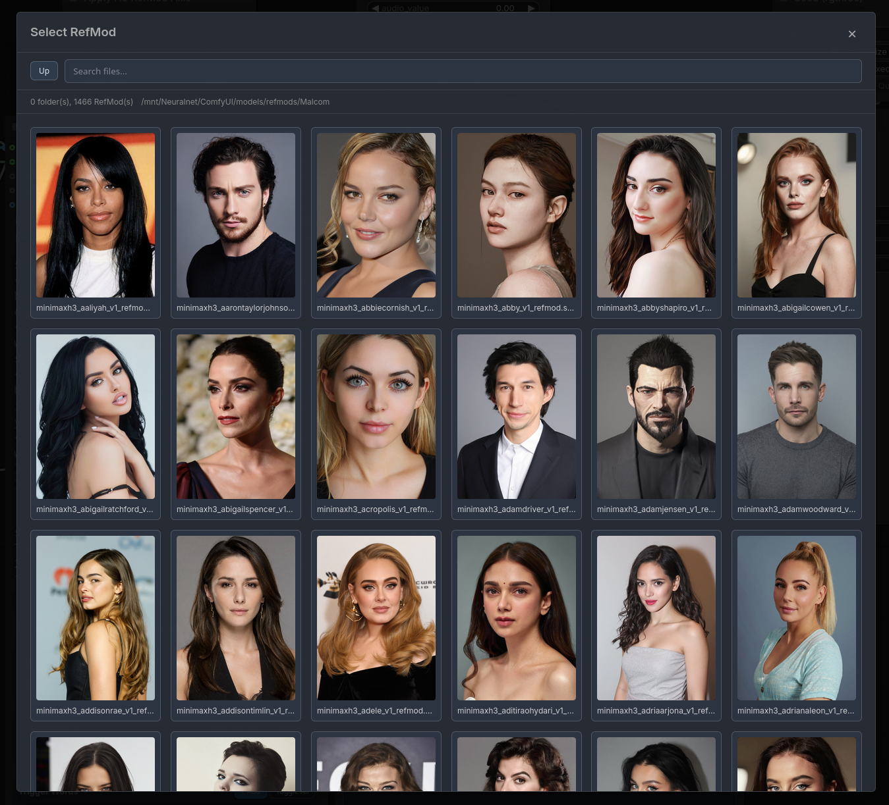
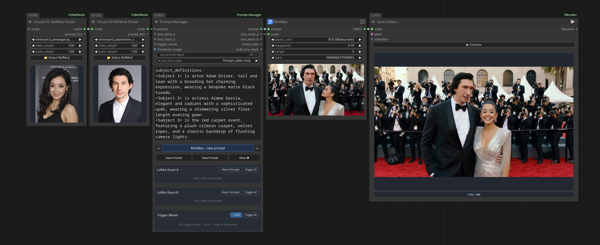
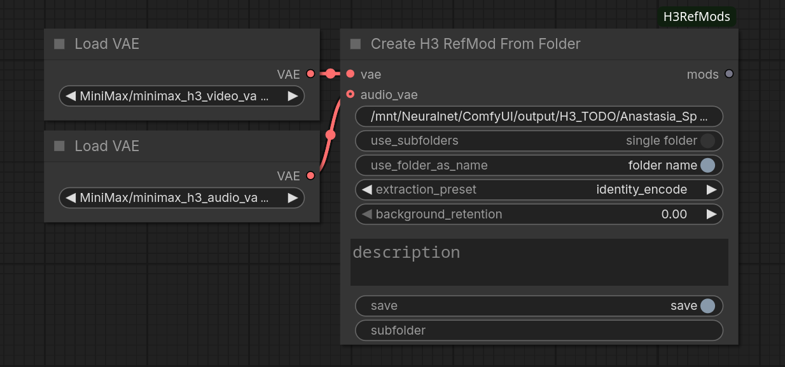

# ComfyUI-H3RefModPicker

Companion add-on for [ComfyUI-MiniMaxH3Mod](https://github.com/Luisacaotica/ComfyUI-MiniMaxH3Mod)

This add-on is meant to work alongside **ComfyUI-MiniMaxH3Mod**. It intentionally provides only a small, focused subset of RefMod features: a visual picker, a simple loader/apply flow, and Create From Folder helpers, while keeping compatibility with the original RefMod format.

If you want the fuller MiniMax H3 RefMod toolset and more creation/apply options, the recommended install is [ComfyUI-MiniMaxH3Mod](https://github.com/Luisacaotica/ComfyUI-MiniMaxH3Mod).


<p align="center">
  
  <br />
  <em>Example using refMods from <a href="https://huggingface.co/spaces/malcolmrey/browser">Malcolm Reynolds</a>.</em>
</p>

<p align="center">
  
  <br />
  <em>Workflow example.</em>
</p>

<p align="center">
  
  <br />
  <em>Create refMods from Folder example.</em>
</p>

## Main additions

- `Visual RefMod Picker` lets you browse using a **RefMods** browser.
- Paired RefMods are grouped as one logical item in the picker. When matching visual and audio files exist together, they are shown as one entry and loaded together, with separate video/audio weight controls. This uses a weight behavior: `0..1` is regular strength, values above `1` expand into repeated copies. For example, a weight of 2.7, would be the same as strenght:1.0, copies:2.7
- `Create H3 RefMod From Folder` scans a folder of images, video, and audio, saves split RefMods. It can also batch-create RefMods for all subfolder found.
- `Load RefMod` is a singular loader. It use the same weight behavior as the Picker.
- `Simple Apply H3 RefMod` and `Apply H3 RefMod Axis` provide a streamlined apply and a simple modulation flow for 2 Characters.
- `tools/generate_video_thumbnails.py` can generate same-name `.png` thumbnails from `.mp4` files in a folder by grabbing a random frame between 25% and 75% of each clip. This is a small helper to speed up large RefMod collections when the videos do not already have preview images. It requires `ffmpeg` and `ffprobe`.

## Notes

- This repo is a minimal companion add-on, not the full RefMod toolkit.
- For more options and the complete MiniMax H3 RefMod feature set, [ComfyUI-MiniMaxH3Mod](https://github.com/Luisacaotica/ComfyUI-MiniMaxH3Mod) is the recommended install.

## Installation

### Manual
```bash
cd ComfyUI/custom_nodes
git clone https://github.com/FranckyB/ComfyUI-H3RefModPicker
```